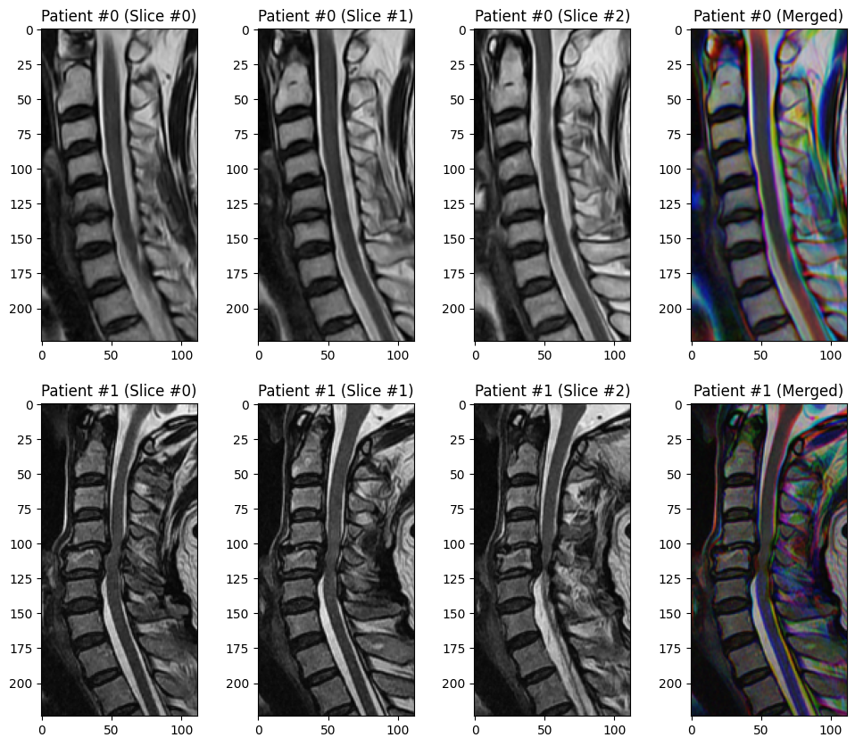

# **Predicting Cervical Canal Stenosis (CCS) from T2 Mid-sagittal MRI**

## **0. Overview**

* This repository contains `python` scripts for executing deep learning models that predict **cervical canal stenosis (CCS)** from **mid-sagittal T2-weighted MRI** of the cervical spine.

* For more information, plese refer to our article titled, ***"Deep learning-based prediction of cervical canal stenosis from mid-sagittal T2-weighted MRI"***, authored by *Wounsuk Rhee MD, Sung Cheol Park MD, Hyoungmin Kim MD PhD (Corresponding author), Bong-Soon Chang MD PhD, and Sam Yeol Chang MD*. (Currently under review)


## **1. Environment Setup**
### **1.1. Create a New (Virtual) Environment**
* `python = 3.11.0`

### **1.2. Install Packages**
* `matplotlib = 3.9.0`
* `numpy = 1.24.0`
* `opencv-python = 4.11.0`
* `pandas = 2.2.3`
* `scikit-learn = 1.6.1`
* `scipy = 1.15.2`
* `tensorflow = 2.14.0`

### **1.3. Clone this GitHub Repository**

```bash
git clone https://github.com/rhee1998/snuh_c_spine_mr_t2sag_ccs.git
```

### **1.4. Download Model Weights from HuggingFace Repository**

* Please run `setup.py` to download model weights.
```bash
cd /path/to/current/directory/
python3 setup.py
```

* This will create a new folder named `model` containing trained model weights

* The file structure of `model` is as follows:
```text
model
|-- Demographics_LogReg
|   |-- log_reg__age__auc=0.9540.pkl
|   |-- log_reg__age_sex__auc=0.9537.pkl
|   |-- log_reg__sex__auc=0.9537.pkl
|
|-- EfficientNetV2
|   |-- weights_0.hdf5
|   |-- weights_1.hdf5
|   |-- weights_2.hdf5
|
|-- MobileNetV3
|   |-- weights_0.hdf5
|   |-- weights_1.hdf5
|   |-- weights_2.hdf5
|
|-- ResNet50
|   |-- weights_0.hdf5
|   |-- weights_1.hdf5
|   |-- weights_2.hdf5
|
|-- VGG16
    |-- weights_0.hdf5
    |-- weights_1.hdf5
    |-- weights_2.hdf5
```

## **2. Sample Inputs**
### **2.1. Demographic Information**
* As an example, we have uploaded two sample cases

<table>
    <tr>
        <th>Case</th>
        <th>Description</th>
        <th>Kang Grade</th>
        <th>CCS Label</th>
    </tr>
    <tr>
        <td>Patient #0</td>
        <td>70-year-old female with no cervical canal stenosis</td>
        <td>0</td>
        <td>0</td>
    </tr>
    <tr>
        <td>Patient#1</td>
        <td>62-year-old male with cervical canal stenosis</td>
        <td>3</td>
        <td>1</td>
    </tr>
</table>

### **2.2. Input Data (MRI Slices)**

* Manually cropped sagittal T2-weighted MRI slices of shape `(224, 112)` are provided.

* Three consecutive slices, in which the mid-sagittal section in the middle, are merged into a 3-channel RGB image

* The merged image is taken as input for the deep learning model


