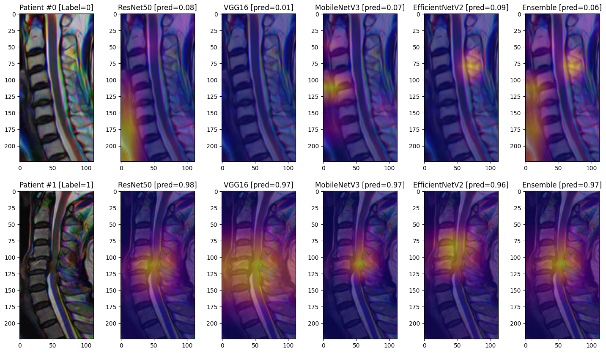

# **Predicting Cervical Canal Stenosis (CCS) from T2 Mid-sagittal MRI**

# **0. Overview**

* This repository contains `python` scripts for executing deep learning models that predict **cervical canal stenosis (CCS)** from **mid-sagittal T2-weighted MRI** of the cervical spine.

* For more information, plese refer to [our paper](https://link.springer.com/article/10.1007/s00256-025-04917-2) published at ***Skeletal Radiology*** in March 2025.

* If you find our paper and repository helpful, please cite our work:</br>

  *Rhee, W., Park, S.C., Kim, H. et al. Deep learning-based prediction of cervical canal stenosis from mid-sagittal T2-weighted MRI. Skeletal Radiol (2025). https://doi.org/10.1007/s00256-025-04917-2*

```
@article{rhee2025deep,
  title={Deep learning-based prediction of cervical canal stenosis from mid-sagittal T2-weighted MRI},
  author={Rhee, Wounsuk and Park, Sung Cheol and Kim, Hyoungmin and Chang, Bong-Soon and Chang, Sam Yeol},
  journal={Skeletal Radiology},
  pages={1--10},
  year={2025},
  publisher={Springer}
}
```


# **1. Environment Setup**
## **1.1. Create a New (Virtual) Environment**
* `python = 3.11.0`

## **1.2. Install Packages**
* `matplotlib = 3.9.0`
* `numpy = 1.24.0`
* `opencv-python = 4.11.0`
* `pandas = 2.2.3`
* `scikit-learn = 1.6.1`
* `scipy = 1.15.2`
* `tensorflow = 2.14.0`

## **1.3. Clone this GitHub Repository**

```bash
git clone https://github.com/rhee1998/snuh_c_spine_mr_t2sag_ccs.git
```

## **1.4. Download Model Weights from HuggingFace Repository**

* Please run `setup.py` to download model weights.
```bash
cd /path/to/current/directory/
python3 setup.py
```

* This will create a new folder named `model` containing trained model weights

* The file structure of `model` is as follows:
```text
model
|-- Demographics_LogReg
|   |-- log_reg__age__auc=0.9540.pkl
|   |-- log_reg__age_sex__auc=0.9537.pkl
|   |-- log_reg__sex__auc=0.9537.pkl
|
|-- EfficientNetV2
|   |-- weights_0.hdf5; weights_1.hdf5; weights_2.hdf5
|
|-- MobileNetV3
|   |-- weights_0.hdf5; weights_1.hdf5; weights_2.hdf5
|
|-- ResNet50
|   |-- weights_0.hdf5; weights_1.hdf5; weights_2.hdf5
|
|-- VGG16
    |-- weights_0.hdf5; weights_1.hdf5; weights_2.hdf5
```

* Models can be downloaded directly from our HuggingFace repository [here](https://huggingface.co/rhee1998/snuh_c_spine_mr_t2sag_ccs/tree/main)

# **2. Sample Inputs**
## **2.1. Demographic Information**
* As an example, we have uploaded two sample cases

<table>
    <tr>
        <th style="background-color": #f0f0f0;">Case</th>
        <th style="background-color": #f0f0f0;">Description</th>
        <th style="background-color": #f0f0f0;">Kang Grade</th>
        <th style="background-color": #f0f0f0;">CCS Label</th>
    </tr>
    <tr></tr>
    <tr>
        <td>Patient #0</td>
        <td>70-year-old female with no cervical canal stenosis</td>
        <td>0</td>
        <td>0</td>
    </tr>
    <tr></tr>
    <tr>
        <td>Patient #1</td>
        <td>62-year-old male with cervical canal stenosis</td>
        <td>3</td>
        <td>1</td>
    </tr>
</table>

## **2.2. Input Data (MRI Slices)**

* Manually cropped sagittal T2-weighted MRI slices of shape `(224, 112)` are provided.

* Three consecutive slices, in which the mid-sagittal section in the middle, are merged into a 3-channel RGB image

* The merged image is taken as input for the deep learning model


# **3. Run Model**

* Jupyter notebook `run_sample.ipynb` contains `python` scripts to run trained models.

* We have trained four different types of models: ResNet50, VGG16, MobileNetV3, and EfficientV2

* Sample codes utilzing models that incorporate `age` and/or `sex` are provided.

* Grad-CAM visualization code is provided as well.


